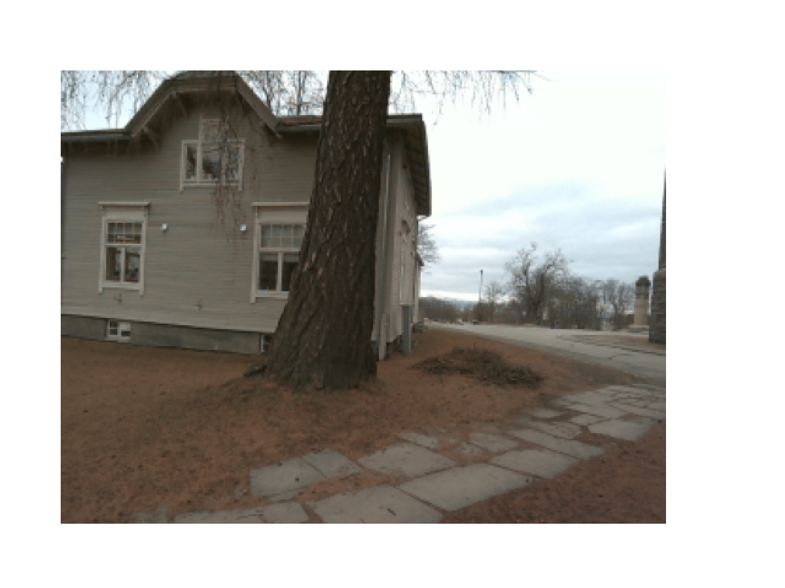

# Perception Module

This module contains the code for the perception component of the drone simulation. It includes scripts for running and pre-training the perception model, as well as utilities for data handling, loading and saving models, and plotting.


## Run
The `run_perception.py` script takes the following args:
```
  mode [str]           : mode to run ('train'/'test')
--model_name [str]     : model architecture, 'conv1' = baseline
--exp_id [int]         : experiment id
--num_seeds [int]      : number of random seeds to train across
--seed [int]           : seed, for testing
--plot [str]           : plotting mode
--num_examples [int]   : number of reconstructions if plot == 'reconstructions'
--batch_size [int]     : batch size during training
--epochs [int]         : max number of training epochs
--latent_dims [int]    : latent dimension (size of bottleneck/z)
--learning_rate [float]: learning rate init.
--beta [float]         : value of the regularization of VAE

```

Example:
```
python run_perception.py train --num_seeds 5  --latent_dims 64 --beta 1.5 --batch_size 32 --learning_rate 0.001 --epochs 20 --plot losses --save_model --exp_id 7
```

For more detailed explenation of arguments:
```
python run_perception.py -h
```

<br/>

**(!) Note:** <br/>
When loading a model for testing with `--model_name <modelname>`, make sure all parameters that affect the architecture of the net (i.e., `--latent_dim`, `--batch_size`, and ofc. `IMG_SIZE` and `NUM_CHANNELS` which are initialized in the VAE object) is set to the same values as during training of the given model. Also, make sure the encoder and decoder objects in the code are identical as during training.


## Files and submodules
The perception module contains the following files and sub-modules:
- `VAE/...`: Contains the encoders, decoders and VAE arcitechture.
- `run_perception.py`: Runs the perception model on the depth data. Takes parsed args.
- `train_perception.py`: Trains the perception model using depth data.
- `utils_perception/data_reader.py`: Contains utility functions for reading and processing the depth data.
- `utils_perception/plotting.py`: Plotting utilities.
- `data/...`: Depth data.
- `models/...`: Trained models.
- `results/...`: Results from training. Divided into numerical and plots as: results/model_name/numerical_or_plots/experiment_id/


## Pretraining VAE using custom dataset:
1. Download the real-word data from [Kaggle](https://www.kaggle.com/datasets/eirikrundebarlaug/depth-maps-intel-realsense-d455)
2. Unzip the contents of the folder and put them in a directory: `./data/[here]`
3. Run the main script

(For synthetic data, do the same procedure after creating data in `../data_collection/data_collector_meshes.py`, but name the directory `"synthetic_depthmaps"` instead)

Current code (18.06.24) uses a combination of real-world and synthetic data which is combined in a directory `./data/all_imgs/`. Combine the two and put in a dir named the same if this is to be used.

#### Real-world data examples
RGB            |  Original depth image           |  Truncated depth image
:-------------------------:|:-------------------------: |:-------------------------:
  |    |   
  |    |   

#### Synthetic data examples
  ex1          |  ex2       |  ex3
:-------------------------:|:-------------------------: |:-------------------------:
  |    |   
