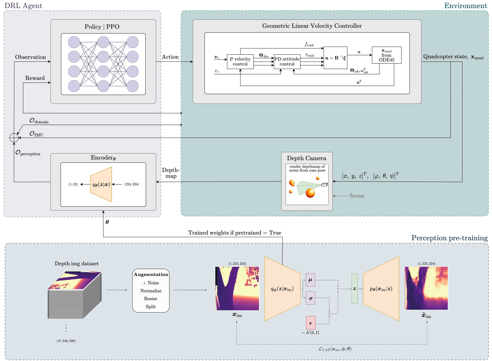

# Autonomous path following and collision avoidance for quadcopters using deep reinforcement learning, a geometric linear velocity controller and a variational auto encoder in a mesh based simulation to take advantage of digital twins
This repo implements a 6-DOF simulation model for a quadcopter according to the stable baselines (OpenAI) interface for reinforcement learning control.


## Quick results overview
Videos of the quadcopter POV alongside a third person view of its position in the scene.

The () indicate which type of DRL agent is being used to control the quadcopter in the scene. 
- _random_ refers to an agent that was trained with a randomly initialized feature extractor for compressing the depth images.
- _conv-locked_ refers to an agent where the convolutional layers of the feature extractor are frozen to match the weights of a pretrained VAE while the projection head is initialized to the pretrained weights, but updated online during training of the DRL agent. 

#### Cave test scenario (_random_)
https://github.com/Jorgenlf/gym_quad/assets/54811706/876b7313-1892-4824-a90f-ca9463795ce5

#### Vertical test scenario (_random_)
https://github.com/Jorgenlf/gym_quad/assets/54811706/99112a5d-85d9-46d8-9b99-acfdc758b7d6

#### Horizontal test scenario (_conv-locked_)
https://github.com/Jorgenlf/gym_quad/assets/54811706/c28a78a0-a006-4508-9d1a-6066ab0bf088

#### Deadend test scenario (_random_)
https://github.com/Jorgenlf/gym_quad/assets/54811706/bb842e0a-f1cf-4cb5-a5f2-97c9873b8937

#### House easy test scenario (_conv-locked_)
https://github.com/Jorgenlf/gym_quad/assets/54811706/441afda5-0ad2-448c-8269-01665c43e629

#### House easy obstacles test scenario (_conv-locked_)
https://github.com/Jorgenlf/gym_quad/assets/54811706/50bf2f11-b0ca-4f0b-a9ed-8356e6dcce54

#### House hard test scenario (_random_)
https://github.com/Jorgenlf/gym_quad/assets/54811706/a1645f9d-2f9a-43d9-b77e-7bc8d0bd80ed

#### House hard obstacles test scenario (_random_)
https://github.com/Jorgenlf/gym_quad/assets/54811706/28318a4e-480d-4b0d-8f71-9ddb1bb2f259


#### Helix test scenario (_conv-locked_)
https://github.com/Jorgenlf/gym_quad/assets/54811706/bd579227-340a-4b87-9e91-40888648eef6

## Architecture
The following figure illustrates the architecture of our approach. The perception pre-training module is located under the `perception/` and (partly) `data_collection/` directories, the PPO policy initialization and training happens in `train3d.py`, the encoder/feature extractor is located in `PPO_feature_extractor.py`, while all modules related to the environment (camera, sensors, path gen, controller, DRL environment, meshes, etc.) are under the `gym_quad/` directory, which makes up the backbone of the system.




## Getting Started
To install all packages needed in your virtual environment, run:

```
conda env create -f environment.yml
```
### If you want to download the stuff yourself or the .yml file doesn't work:
You can follow this guide or do the steps below:
https://github.com/facebookresearch/pytorch3d/blob/main/INSTALL.md

Essentially, on windows do these:

1.  ``` conda create -n [name] python=3.10 ```

2. Choose cuda version to use (Suggest 12.1 as it is most up to date and compatible with the rest of the packages at the time of writing). 
- If you dont have cuda: https://developer.nvidia.com/cuda-12-1-0-download-archive 
- If you have cuda and need to change version follow this guide: https://github.com/bycloudai/SwapCudaVersionWindows   
- cuda 12.1: ``` conda install pytorch==2.2.0 torchvision==0.17.0 torchaudio==2.2.0 pytorch-cuda=12.1 -c pytorch -c nvidia ```
- cuda 11.8: ``` conda install pytorch==2.2.0 torchvision==0.17.0 torchaudio==2.2.0 pytorch-cuda=11.8 -c pytorch -c nvidia ```

3.  ``` conda install -c fvcore -c iopath -c conda-forge fvcore iopath ```

4.  ``` pip install "git+https://github.com/facebookresearch/pytorch3d.git" ``` 

5.  ```pip install gymnasium stable-baselines3 rich numba trimesh python-fcl vispy tensorboard imageio snakeviz scipy pycollada pyglet vtk pyvista trame```

### Training an agent:
The DRL environment hyperparameters can be tuned in the main config file, `gym_quad/drl_config.py`. This is then copied to `gym_quad/train3d.py`, where you can change certain hyperparameteres to better support training mode and also select the remaining hyperparameters: curriculum training setup, PPO and feature extractor.

For training an agent, run:

```
python train3d.py --exp_id [x] --n_cpu [y]
```

- x: experiment id number
- y: number of cpus to train on

### Running an agent in the environment
Copies the hyperparams from `gym_quad/drl_config.py` and changes certain hyperparam supporting running of agent in `gym_quad/run3d.py`.

For running an agent in any scenario, use:
```
python run3d.py --env "" --exp_id x --run_scenario "..." --trained_scenario "..." --agent x --episodes x 
```

- env: the gym environment to use (defaults to LV_VAE_MESH-v0)
- exp_id: which experiment to retrieve agent from (defaults to 1)
- run_scenario: which scenario to run (defaults to line)
- trained_scenario: which scenario the agent was trained in (defaults to line)
- agent: The timestep of the agent (defaults to the "last_model.zip" saved model from a completed training)
- episodes: how many episodes to repeat the run. (defaults to one)

There are some additional args. For more info, view `gym_quad/utils.py` and inspect `parse_experiment_info()`.

The trained DRL agents and the pre-trained VAE feature extractor can be downloaded [here](https://1drv.ms/f/c/8c154251101af41c/EsTTn57JK5hMs9Zd7-yPRUwBa-2gTHg6VVDjij6jVvzvYw?e=w6oKNN)

### Running in manual debug mode
The run3d.py script has a mode for realtime visualization where you can control the quadcopter using wasd and spacebar. 

EITHER 

open the run3d.py script uncomment the 
    ```args = Namespace(manual_control=True, env = "LV_VAE_MESH-v0", save_depth_maps=False)``` 
line and run the script using Fn+f5 

OR

run the script from the terminal and set the two arguments --RT_vis True and ----manual_control True.

This is an overview of how keyboardinputs map to moving the quadcopter:

| Key Press | Action Description | Input Mapping | Notes |
|-----------|--------------------|---------------|-------|
| `w`       | Forward            | `[1, 0.3, 0]` | Moves the drone forward |
| `a`       | Rotate left        | `[-1, 0, 1]`  | Applies maximum positive yaw, rotating the drone to the left. |
| `d`       | Rotate right       | `[-1, 0, -1]` | Applies maximum negative yaw, essentially rotating the drone to the right. |
| `s`       | Down               | `[1, -1, 0]`  | Directs the drone downwards, using a negative pitch. This is less usual as geometric control typically aims to maintain hovering. |
| `Space`   | Up                 | `[1, 1, 0]`   | Directs the drone upwards; the most positive pitch is used to achieve this. |
| `escape`  | Exit environment   | N/A           | Closes the simulation or control environment. |

### Generating results 
Copies the `gym_quad/drl_config.py` hyperparameters and changes certain hyperparam supporting resultgen in `gym_quad/result_gen.py` for mass result generation. Four modes:

1. Testing all trained agents in the trainedlist across all scenarios in the testlist
    ``` python result_gen.py --exp_id 19 --episodes 10 --trained_list expert expert_perturbed --test_list horizontal vertical deadend random_corridor house --test_all_agents True```
2. Testing a specific trained agent from a specific training scenario across all scenarios in the testlist
    ```python result_gen.py --exp_id 19 --episodes 10 --trained_list expert --test_list horizontal vertical deadend random_corridor house --agent "name"```


